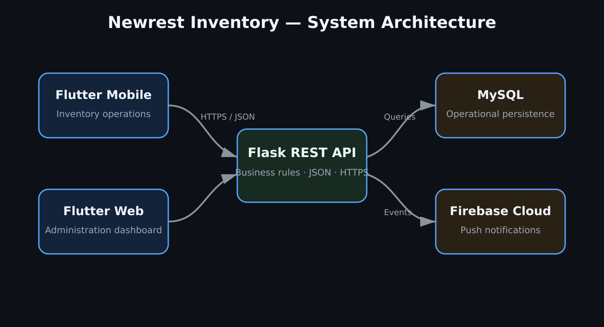
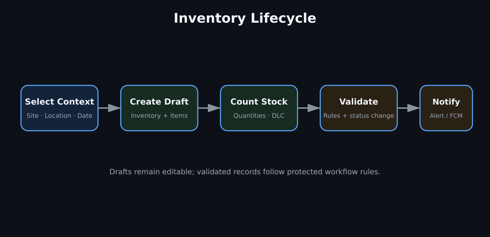
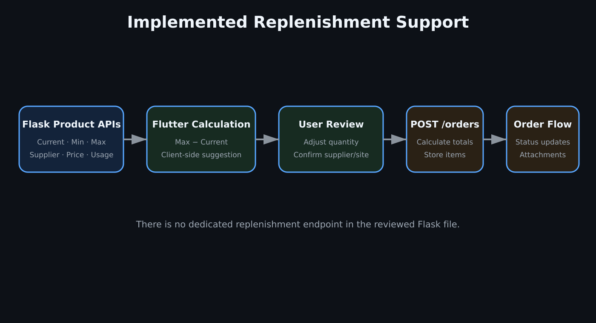

# Newrest Inventory Flask API — Technical Showcase


> A documentation-only showcase based on the real private Flask API that powers the Newrest Inventory mobile and web applications.

## Overview

This API is implemented as a Flask application using `mysql.connector` and JSON HTTP endpoints. It provides the shared data and business layer for the Flutter Android application and Flutter Web dashboard.

The reviewed implementation contains **52 Flask route declarations** covering products, product configuration, reports, purchase orders, inventories, accounts, profile images, alerts, dashboard analytics, file attachments, Firebase Cloud Messaging tokens, and stock simulation.

The private source code, credentials, production data, and infrastructure secrets are intentionally excluded. Every example in this repository is fictional and sanitized.

## System Architecture

<p align="center">
  
</p>

## Implemented Capabilities

- Product listing, search, configuration, and site-aware stock totals
- Product report details, including supplier, unit price, batch, DLC, and expiry window
- Category/product stock-movement reporting from daily stock snapshots
- Inventory creation, replacement-style draft updates, validation, and deletion
- Inventory validation that updates actual stock, theoretical stock, and stock snapshots
- User registration, login, status management, profile images, and FCM-token registration
- Password hashing and verification through Werkzeug
- Alert creation, reading, archiving, deletion, and site-targeted FCM delivery
- Dashboard totals, inventory evolution, recent inventories, alerts, and low-stock products
- Purchase-order CRUD, status updates, items, attachments, summaries, and export history
- Report-history storage
- Simulated theoretical-stock consumption and snapshot generation

## Inventory Validation

Inventory submission is not only a status change. The real `PATCH /inventories/{id}/submit` implementation:

1. Validates the submitting user metadata.
2. Changes the inventory status to `validated`.
3. Reads every counted inventory item.
4. Upserts the counted quantity into `stock_actual`.
5. Upserts the same value into `stock_theoretical` with source `inventory`.
6. Inserts a historical row into `stock_snapshots`.
7. Commits the complete operation as one database transaction.

<p align="center">
  
</p>

## Replenishment Support

The API supplies the data needed by the Flutter client to recommend replenishment:

- `currentQty` from actual stock, falling back to theoretical stock
- Configurable `minQty` and `maxQty`
- Supplier, unit, and unit price
- Average weekly usage derived from 28 days of snapshots
- Last order date and quantity
- Low-stock product lists

The current API does **not** expose a dedicated replenishment-calculation endpoint. The client can derive:

```text
Suggested quantity = Maximum quantity − Current quantity
```

It then prefills the purchase-order request, which is reviewed by the user before submission.

<p align="center">
  
</p>

## API Groups

| Group | Main responsibilities |
|---|---|
| Products | Catalog, search, stock configuration, and product summaries |
| Reports | Product details, stock movement, and report-history records |
| Orders | Orders, items, statuses, attachments, summaries, and recent files |
| Inventories | Drafts, items, validation, stock updates, and snapshots |
| Accounts | Registration, login, profiles, statuses, and FCM tokens |
| Alerts | Creation, filtering, read/archive state, deletion, and FCM dispatch |
| Dashboard | Totals, alerts, inventory evolution, recent activity, and low stock |
| Simulation | Test-only theoretical-stock consumption and snapshots |

See the [complete route reference](docs/api-endpoints.md).

## Documentation

- [Architecture](docs/architecture.md)
- [API endpoints](docs/api-endpoints.md)
- [Authentication and current security state](docs/authentication.md)
- [Database design](docs/database-design.md)
- [Deployment](docs/deployment.md)
- [Implementation notes and hardening backlog](docs/implementation-notes.md)

## Sanitized Examples

- [Login request](examples/login-request.json)
- [Login response](examples/login-response.json)
- [Inventory response](examples/inventory-response.json)
- [Product configuration response](examples/product-config-response.json)
- [Order request](examples/order-request.json)

## Actual Technologies Observed

- Python
- Flask and Flask-CORS
- `mysql.connector`
- Werkzeug password hashing and secure filenames
- Firebase Admin SDK and Firebase Cloud Messaging
- Docker deployment
- Render API hosting
- Railway MySQL
- Flutter mobile and web clients

## Privacy Notice

This repository excludes production source code, database credentials, environment variables, Firebase service-account files, tokens, real company records, uploaded files, and private infrastructure URLs.

## Related Showcase

[Newrest Inventory Mobile & Web Showcase](https://github.com/ElAdelZakaryae/newrest-inventory-showcase)

## Author

**EL-ADEL Zakaryae**

<h2 align="left">Connect with Me</h2>

<p align="left">
  <a
    href="https://github.com/ElAdelZakaryae"
    target="_blank"
    rel="noreferrer"
  >
    
  </a>

  <a
    href="https://www.linkedin.com/in/el-adel-zakaryae-156b782b0/"
    target="_blank"
    rel="noreferrer"
  >
    
  </a>

  <a
    href="https://mail.google.com/mail/?view=cm&fs=1&to=eladel.zakaryae.15@gmail.com&su=Contact%20from%20GitHub"
    target="_blank"
    rel="noreferrer"
  >
    
  </a>
</p>

