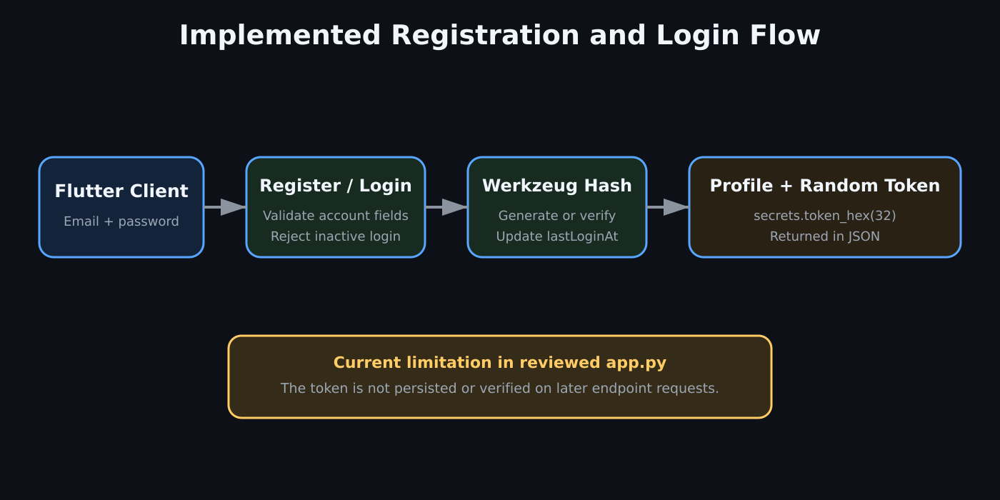

# Authentication and Current Security State

## Implemented Account Flow

### Registration

`POST /register`:

- Requires email, password, first name, last name, and site.
- Validates account status and role fields.
- Detects active and inactive duplicate accounts.
- Hashes passwords with Werkzeug before inserting them.
- Creates a UUID user identifier.
- Returns safe profile fields and a random token.

### Login

`POST /login`:

- Requires email and password.
- Uses the same generic error for an unknown user or incorrect password.
- Rejects inactive accounts.
- Verifies the stored Werkzeug password hash.
- Updates `lastLoginAt`.
- Returns safe profile fields and a token generated by `secrets.token_hex(32)`.

## Important Accuracy Note

In the reviewed `app.py`, the returned token is not persisted in a session table and there is no request hook or decorator that validates the token on later routes. The file also contains no server-side role guard for product configuration, users, orders, or inventories.

Therefore, this showcase does not claim that the current endpoints are protected by JWT, bearer-token validation, or enforced role-based authorization.

## Implemented Security Positives

- Password hashing and verification
- Parameterized MySQL statements
- Generic invalid-login response
- Inactive-account rejection
- Environment-based active database URL
- `secure_filename` for uploaded files
- Attachment extension allowlist
- Database rollback for failed multi-step operations

## Recommended Hardening

1. Persist hashed session tokens or adopt a properly verified JWT/session solution.
2. Add an authentication decorator to protected endpoints.
3. Enforce roles and site scope on the server, not only in Flutter.
4. Restrict CORS to approved application origins.
5. Remove or protect `/debug-user` and `/simulate/theoretical-stock`.
6. Add a profile-image MIME/extension allowlist and upload-size limits.
7. Avoid returning raw exception strings to clients.
8. Validate workflow transitions for inventories and orders on the server.
9. Add rate limiting to `/login` and `/register`.
10. Rotate any credential that has ever been committed, even in a comment.

